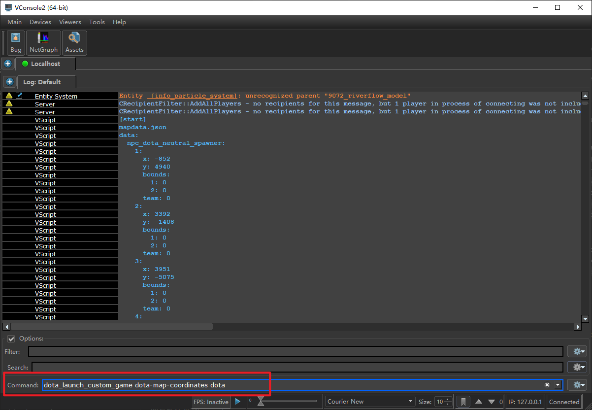
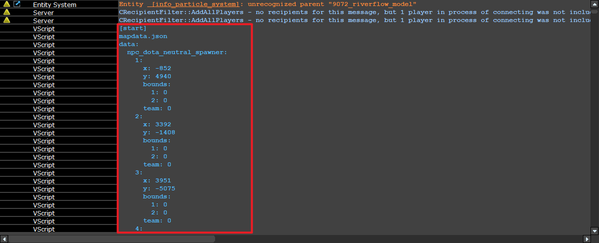

# Dota 2 Map Data Extractor

> Based on [devilesk/dota-map-coordinates](https://github.com/devilesk/dota-map-coordinates) - Updated for Python 3.9+ with simplified VConsole workflow

Extract map coordinate data (buildings, trees, elevation, etc.) from Dota 2 for each patch update.

**Updated for Python 3.9+** (original scripts required Python 2.7)

## Prerequisites

- **Python 3.9+** with packages: `matplotlib`, `numpy`, `Pillow`
- **Node.js** (optional, for parsing vmap files)
- **Dota 2 Workshop Tools** (Steam: Right-click Dota 2 → Properties → DLC → Install Workshop Tools)

Install Python packages:
```
pip install matplotlib numpy Pillow
```

## Quick Start (Simplified Workflow)

### Step 0: Update Map Files (For New Dota Patches)

Edit `copymap.bat` and set your Dota 2 path:
```bat
set DOTA_PATH=E:\SteamLibrary\steamapps\common\dota 2 beta
```

Run `copymap.bat` to copy latest map files from Dota 2 to the addon folders.

### Step 1: Install the Custom Game Addon

Copy both folders to your Dota 2 directory:

```
addon/   → <DOTA_PATH>\game\dota_addons\dota-map-coordinates\
content/ → <DOTA_PATH>\content\dota_addons\dota-map-coordinates\
```

### Step 2: Run the Custom Game & Save Console Output

1. Launch **Dota 2 Workshop Tools** (Right-click Dota 2 → "Launch Dota 2 - Tools")
2. Open the Workshop Tools, select custom game `dota-map-coordinates`
3. Launch the game, open VConsole, run: `dota_launch_custom_game dota-map-coordinates dota`



4. Select a hero and enter the game
5. Wait for game to fully load - data prints to VConsole with `[start]`/`[end]` markers



**Save VConsole output:**
- VConsole logs are typically saved in your Dota 2 directory
- Or copy the entire console output manually

### Step 3: Process the Console Log

1. **Copy your console log file** to `datav2/current_version.log`

2. **Run the parser** to generate JSON files:
   ```
   python process_console.py
   ```
   
   Output (in `datav2/` folder):
   - `mapdata.json` - Buildings, trees, shops, spawners coordinates
   - `worlddata.json` - Map dimensions  
   - `gridnavdata.json` - Untraversable grid tiles
   - `elevationdata.json` - Elevation data per tile

### Step 4: Generate Images (Optional)

```
python process_data.py
```

Output (in `img/` folder):
- `gridnav.png` - Walkable/blocked areas
- `elevation.png` - Terrain elevation
- `tree_elevation.png` - Tree positions with elevation
- `map_data.png` - Combined stitched image

**Note:** Full image generation requires `.vmap.txt` files. Basic images (gridnav, elevation, tree_elevation) work with just the JSON data.

## What Was Fixed (Python 3 Compatibility)

### process_console.py
- Changed input file: `data/723_data.log` → `datav2/current_version.log`
- Added VConsole prefix stripping: `[   VScript                ]: ` 
- Added UTF-8 encoding with error handling
- Fixed string split for colon handling

### process_data.py
- Changed all paths: `data/` → `datav2/`
- Added bounds checking for pixel operations (prevents IndexError)

## File Structure

```
dota-map-extractor/
├── addon/                    # Game addon (copy to dota_addons/)
│   └── scripts/vscripts/
│       └── addon_game_mode.lua
├── content/                  # Content addon (copy to content/dota_addons/)
│   └── dota_addons/dota-map-coordinates/maps/
├── datav2/                   # Put console log here, JSON output here
│   └── current_version.log   # ← Your console log goes here
├── img/                      # Generated images output
├── copymap.bat               # Copies latest map files from Dota 2
├── process_console.py        # Parses console log → JSON (Python 3)
├── process_data.py           # Generates images from JSON (Python 3)
├── graham_scan.py            # Convex hull algorithm
├── keyvalues2.js             # Valve KeyValues parser
└── README.md
```

## Console Log Format

The Lua addon prints data via `print()` to VConsole:
```
[   VScript                ]: [start]
[   VScript                ]: mapdata.json
[   VScript                ]: data:
[   VScript                ]:   npc_dota_tower:
[   VScript                ]:     1:
[   VScript                ]:       x: 1234
[   VScript                ]:       y: 5678
...
[   VScript                ]: [end]
```

`process_console.py` strips the prefix and parses the indented YAML-like structure into JSON.

## Troubleshooting

| Issue | Solution |
|-------|----------|
| Empty JSON files | Check console log has `[start]`/`[end]` markers |
| `UnicodeDecodeError` | Already handled with `errors='ignore'` |
| `IndexError: image index out of range` | Already fixed with bounds checking |
| Missing `.vmap.txt` files | Some images won't generate, but core JSON works |

## For Future Dota 2 Updates

1. Run `copymap.bat` to get latest map files
2. Copy `addon/` and `content/` to Dota 2
3. Run custom game in Workshop Tools: `dota_launch_custom_game dota-map-coordinates dota`
4. Copy VConsole log to `datav2/current_version.log`
5. Run `python process_console.py` → generates JSON
6. Run `python process_data.py` (optional) → generates images
7. Done! JSON files are in `datav2/`, images in `img/`
